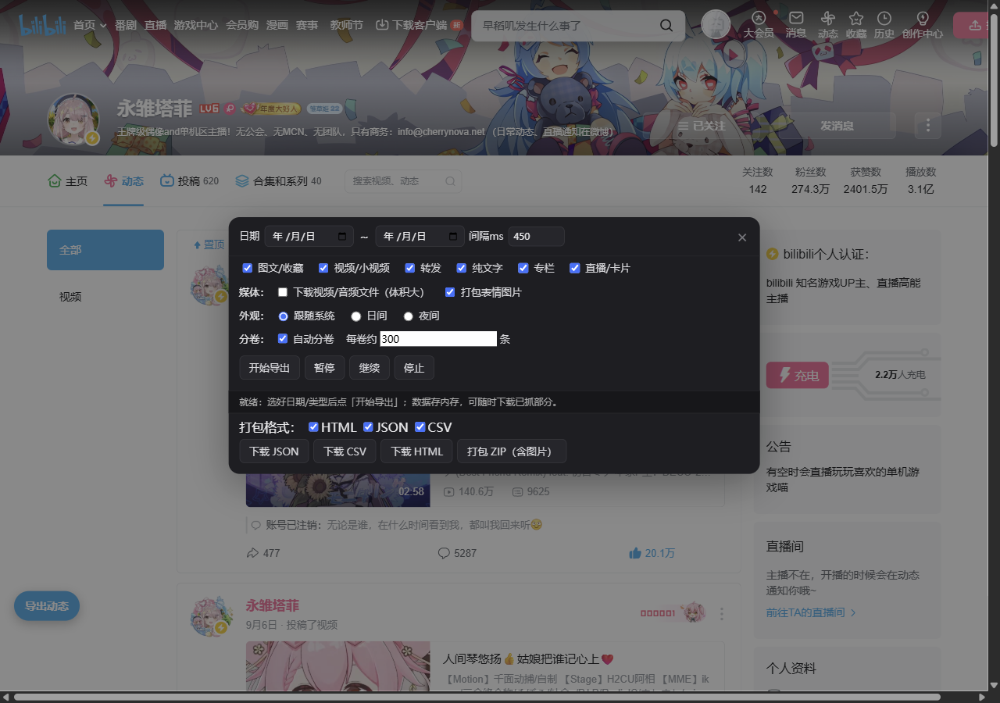

# B站动态工具集

一套运行在 B站用户空间（`space.bilibili.com/<uid>/dynamic`）上的 Tampermonkey 用户脚本，包含两个相互独立、可同时安装的工具：

- **B站动态分页浏览**（`bilibili-dynamic-pager.user.js`）：把无限下拉的动态流改成按页浏览
- **B站动态提取导出器**（`bilibili-dynamic-exporter.user.js`）：按日期/类型抓取并打包成离线归档 ZIP

MIT 协议，© 2026 UIM258。

## 效果预览

分页浏览（以 @永雏塔菲 的主页为例）：


提取导出器（日期范围 + 类型/媒体勾选）：


## 安装

- 浏览器安装 [Tampermonkey](https://www.tampermonkey.net/)
- 打开对应 `.user.js` 的 Raw 地址安装，或从 GreasyFork 一键安装：
  - 分页浏览：https://greasyfork.org/zh-CN/scripts/595144
  - 提取导出：https://greasyfork.org/zh-CN/scripts/595147
- **登录 B 站**后打开任意用户空间（`https://space.bilibili.com/<uid>/dynamic`），页面角落会出现悬浮按钮
- 部分 UP 主动态需登录后才可见，脚本需登录态才能正常工作

## 脚本一：分页浏览

- 本地分页：上一页 / 下一页（末页自动续载）/ 输入页码跳转
- 「日期直达」与「直达最早」，方便考古；可随时停止加载
- 支持图文/收藏、视频/小视频、专栏、纯文字、转发（内嵌原博媒体）、直播/卡片等格式
- 富文本表情（含收藏集/装扮表情）与作者装扮徽章
- 图片点击灯箱预览，多图 ←/→ 切换
- 每条动态一键直达原页面，支持动态 ID 直达
- 外观：跟随系统 / 日间 / 夜间

## 脚本二：提取导出器

- **日期范围**：选择 开始日期 ～ 结束日期（可留空）
- **内容筛选**（8 类）：图文、收藏夹、视频、小视频、转发、纯文字、专栏、其他卡片
  - 图文 = 带图动态/相册（opus）；收藏夹 = B站合集/收藏夹动态（medialist）
  - 视频 = 投稿视频；小视频 = 按动态标签识别（仅标签含“小视频”），导出到独立目录
  - 转发 = 转发动态；纯文字 = 无媒体文字动态
  - 专栏 = 抓取全文，单独保存为 articles/ 下的 HTML（含正文图片）；其他卡片 = 直播/游戏/评分/榜单等卡片类动态
- **导出格式**：HTML / JSON / CSV 可勾选
- **媒体打包**：图片、表情、视频/音频可选；**视频清晰度可选**（自动/1080P+/1080P/720P/480P/360P，受账号权限限制）\n- **视频文件两种模式**：单文件（含音轨、免合并，HTML 可直接播放，最高约 720P）/ 分片（清晰度更高到 1080P+，需 ffmpeg 合并）
- **完整内容**：正文/表情/图片、视频（BV/标题/封面/时长）、专栏、直播、卡片、转发原博
- **投票 / 抽奖**：选项与票数、奖品与开奖信息（JSON 保留原始结构）
- 进度 / 暂停 / 继续 / 停止；逐页限速与失败重试

### ZIP 结构

```
<用户ID>_<YYYYMMDD-YYYYMMDD>_dynamic-export\
├── messages.html / messages2.html / …
├── messages.json / messages.csv
├── photos\          ← 图片
├── media\covers\    ← 视频 / 文章封面
├── media\avatar     ← 作者头像
├── emoticons\       ← 表情图片
├── video_files\     ← 视频 / 音频（DASH .m4s，以 BV 号命名）\n├── short_videos\    ← 小视频 / 音频\n├── articles\        ← 专栏全文 HTML\n├── articles\images\ ← 专栏正文图片
├── 合并视频.bat      ← 用 ffmpeg 合并为 mp4
└── media_links.txt  ← 抓取失败媒体直链兜底
```

### 视频合并

B站视频为 DASH 分离流（`_video.m4s` + `_audio.m4s`）。安装 ffmpeg 后（Windows：`winget install Gyan.FFmpeg`），解压 ZIP 后双击「合并视频.bat」自动合并全部；只想合并单个视频，双击对应目录下的 `合并_BV号.bat`。注意：在浏览器里点 bat 只会显示文本（不会执行），必须在解压后的文件夹里双击。

## 说明

- 动态很多时，日期直达/最早与全量导出需要较长时间，请保持间隔，可随时暂停
- 视频/音频文件体积较大，按需勾选
- 个别图片/表情可能因 CDN 限制抓取失败，会自动写入 `media_links.txt`

## 目录结构

```
├── bilibili-dynamic-pager.user.js      # 分页浏览
├── bilibili-dynamic-exporter.user.js   # 提取导出
├── LICENSE
└── README.md
```